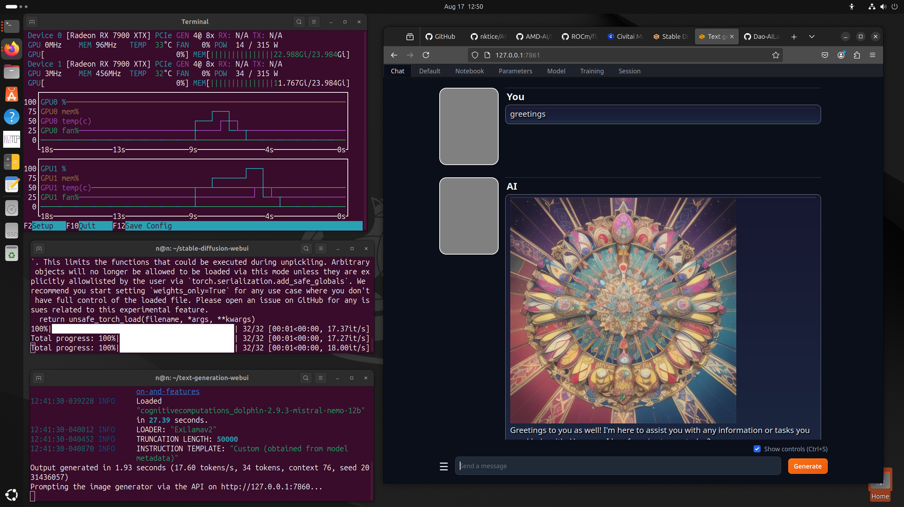

# AMD AI - A guide for common AI tools on AMD Radeon GPU systems
## AMD Radeon 7900XTX GPU ROCm install / setup / config 
# Ubuntu 26.04
# ROCm 7.2.2
# SDnext ( Stable Diffusion ) + ComfyUI ( venv ) 
# Oobabooga - TextGen WebUI

## Install notes / instructions 
This file is focused on the current stable version of PyTorch.  There is another variation of these instructions for the development / nightly version(s) here : https://github.com/nktice/AMD-AI/blob/main/dev.md

2023-07 - 
 I have composed this collection of instructions as they are my notes.
 I use this setup my own Linux system with AMD parts.
 I've gone over these doing many re-installs to get them all right.
 This is what I had hoped to find when I had search for install instructions -
 so I'm sharing them in the hopes that they save time for other people. 
 There may be in here extra parts that aren't needed but this works for me.
 Originally text, with comments like a shell script that I cut and paste.

2023-09-09 - I had a report that this doesn't work in virtual machines (virtualbox) as the system there cannot see the hardware, it can't load drivers, etc.  While this is not a guide about Windows, Windows users may find it more helpful to try DirectML - https://rocm.docs.amd.com/en/latest/deploy/windows/quick_start.html / https://github.com/lshqqytiger/stable-diffusion-webui-directml

[ ... updates abridged ... ] 

2026-04-24 - Updates for new Ubuntu LTS 26.04 ...


-----


# Ubuntu 26.04 - Base system install 
[ Also worked on 24.04.4 and 25.10 ... ] 


At this point we assume you've done the system install
and you know what that is, have a user, root, etc. 

```bash
# update system packages 
sudo apt update -y && sudo apt upgrade -y 
```

## Add AMD GPU package sources 
Make the directory if it doesn't exist yet.
This location is recommended by the distribution maintainers.
https://rocm.docs.amd.com/projects/install-on-linux/en/latest/install/install-methods/package-manager/package-manager-ubuntu.html

```bash
# Make the directory if it doesn't exist yet.
# This location is recommended by the distribution maintainers.
sudo mkdir --parents --mode=0755 /etc/apt/keyrings

# Download the key, convert the signing-key to a full
# keyring required by apt and store in the keyring directory
wget https://repo.radeon.com/rocm/rocm.gpg.key -O - | \
    gpg --dearmor | sudo tee /etc/apt/keyrings/rocm.gpg > /dev/null
```


```bash
sudo tee /etc/apt/sources.list.d/rocm.list << EOF
deb [arch=amd64 signed-by=/etc/apt/keyrings/rocm.gpg] https://repo.radeon.com/rocm/apt/7.2.2 noble main
deb [arch=amd64 signed-by=/etc/apt/keyrings/rocm.gpg] https://repo.radeon.com/graphics/7.2.1/ubuntu noble main
EOF

sudo tee /etc/apt/preferences.d/rocm-pin-600 << EOF
Package: *
Pin: release o=repo.radeon.com
Pin-Priority: 600
EOF

sudo apt update
```


# More AMD ROCm related packages 
Here's a complete list of packages they offer and what they include...
https://rocm.docs.amd.com/projects/install-on-linux/en/latest/install/install-methods/package-manager/package-manager-ubuntu.html#install-rocm
```bash
# ROCm...
# sudo apt install -y rocm 
sudo apt install -y rocm rocm-dev rocm-libs rocm-hip-sdk rocm-libs
```

```bash
# update path
echo "PATH=/opt/rocm/bin:/opt/rocm/opencl/bin:$PATH" >> ~/.profile
```

```bash
#export LD_LIBRARY_PATH=/opt/rocm-7.2/lib
export LD_LIBRARY_PATH=/opt/rocm/lib
```


## Find graphics device
```bash
sudo /opt/rocm/bin/rocminfo | grep gfx
```
Examples of things you'd see... 
Found : gfx1030 [ Radeon 6900 ]
Found : gfx1100 [ Radeon 7900 ] 
Found : gfx1151 [ Ryzen AI Max 395+ ( Strix Halo ) ] 


## Add user to groups
Of course note to change the user name to match your user. 
```bash
sudo adduser `whoami` video
sudo adduser `whoami` render
```

```bash
# git and git-lfs (large file support
sudo apt install -y git git-lfs
# development tool may be required later...
sudo apt install -y libstdc++-12-dev
# stable diffusion likes TCMalloc...
sudo apt install -y libtcmalloc-minimal4
```

## Performance Tuning
This section is optional, and as such has been moved to [performance-tuning](https://github.com/nktice/AMD-AI/blob/main/performance-tuning.md)

## Top for video memory and usage
nvtop 
Note : I have had issues with the distro version crashes with 2 GPUs, installing new version from sources works fine.  Instructions for that are included at the bottom, as they depend on things installed between here and there.   Project website : https://github.com/Syllo/nvtop 
```bash
sudo apt install -y nvtop 
```

## Radeon specific tools...
```bash
sudo apt install -y radeontop rovclock
```

## and now we reboot...
```bash
reboot
```

## End of OS / base setup

---

# Stable Diffusion 
Stable Diffusion is an amazing system to make AI art.  SDNext is a well maintained and excellent successor to the older A1111 and similar systems.


## SDNext
Here are instructions for for setting up SD Next a descendent of Stable Diffusion that looks like it is maintained at the present time.  
Project page : https://github.com/vladmandic/sdnext 
2025-11-03 - Added these instructions...

```bash
sudo apt install python3 python3-venv git git-lfs
```

First we download the latest from GitHub...
```bash
cd
git clone https://github.com/vladmandic/sdnext.git
cd sdnext
```


## Note on memory use with SDNext ... 
2025-11-25 - 
A friend that I helped found that when generating lots of images system memory was a gradual slope up until program crash.  Turns out pymalloc is known to have some issues freeing memory.  SDNext's wiki has details for alternate memory systems - https://github.com/vladmandic/sdnext/wiki/Malloc - We switched over to the use of jemalloc and that resolved things. 

To make that easy, here's commands that users can copy for themselves...
```bash
sudo apt install libjemalloc2
sudo ldconfig
tee --append sdnext.sh <<EOF
#!/bin/sh
#script to call webui.sh with parameters... add others if you like below... 
export LD_PRELOAD=libjemalloc.so.2  
./webui.sh --debug
# if you have models you can specify them on the command line such as with the following :
#./webui.sh --debug --models-dir ~/models
EOF
chmod +x sdnext.sh
```
That creates a script called sdnext.sh for users to run. 

## Run SD...
 Note that the first time it starts it may take it a while to go and get things
 it's not always good about saying what it's up to. 
```bash
./sdnext.sh 
```

## end Stable Diffusion 

-------

# ComfyUI install script 
- variation of https://raw.githubusercontent.com/ltdrdata/ComfyUI-Manager/main/scripts/install-comfyui-venv-linux.sh 
Includes ComfyUI-Manager

Same install of packages here as for Stable Diffusion ( included here in case you're not installed SD and just want ComfyUI... ) 
```bash
sudo apt install -y wget git python3.10 python3.10-venv libgl1 
```

```bash
cd 
git clone https://github.com/comfyanonymous/ComfyUI
cd ComfyUI/custom_nodes
git clone https://github.com/ltdrdata/ComfyUI-Manager
cd ..
python3 -m venv venv
source venv/bin/activate
python3 -m pip install -U pip 
## pre-install torch and torchvision from nightlies - note you may want to update versions... 
python3 -m pip install --pre torch torchvision  torchsde torchaudio einops transformers safetensors aiohttp pyyaml Pillow scipy tqdm psutil av --extra-index-url https://download.pytorch.org/whl/rocm7.2
## Note the following manually includes the contents of requirements.txt - because otherwise attempting to install the requirements goes and reinstalls torch over again. 
python3 -m pip install -r requirements.txt  --extra-index-url https://download.pytorch.org/whl/rocm7.2

python3 -m pip install -r custom_nodes/ComfyUI-Manager/requirements.txt --extra-index-url https://download.pytorch.org/whl/rocm7.2

# end vend if needed...
deactivate
```

Scripts for running the program...
```bash
# run_gpu.sh
tee --append run_gpu.sh <<EOF
#!/bin/bash
source venv/bin/activate
python3 main.py --preview-method auto
EOF
chmod +x run_gpu.sh

#run_cpu.sh
tee --append run_cpu.sh <<EOF
#!/bin/bash
source venv/bin/activate
python3 main.py --preview-method auto --cpu
EOF
chmod +x run_cpu.sh
```

## End ComfyUI install


---

#  Oobabooga - ( formerly Text-Generation-Webui ) 
Project Website : https://github.com/oobabooga/text-generation-webui.git

## Conda
2025-10-23 - In working with Ubuntu 25.10 I found there's an issue with Conda in various forms.  Turns out Ubuntu is shipping with a version of md5sum that makes different results from standard version, thus causes messes... there's a work around, as I'll get to below... but in my review, I found that there is not need for a bunch of stuff that there used to be... Oobabooga now has a working installer that is usable.  [ It used to be that their installer didn't work, and so we needed to setup ourselves with the whole environment and dependencies... that appears over, so we can slim this all down to a few commands. ] 

Here are the details of the work-around to use for new Ubuntu ( 25.10 ) :
https://forum.anaconda.com/t/critical-installation-failure-persistent-internal-md5-mismatch-anaconda-miniconda-2025-06-on-ubuntu-25-10/107525

Here are the commands to switch to GNU version of md5sum :
```bash
sudo apt install curl coreutils-from-gnu coreutils-from-uutils- --allow-remove-essential
```

## Oobabooga / textgen - Install webui...

```bash
cd
git clone https://github.com/oobabooga/textgen
cd textgen
```

Models 
If you're new to this - new models can be downloaded from the shell via a python script, or from a form in the interface.
There are lots of them - http://huggingface.co 
Generally the GPTQ models by Unsloth are likely to load... https://huggingface.co/unsloth  The 30B/33B models will load on 24GB of VRAM, but may error, or run out of memory depending on usage and parameters.  

To get new models note the ~/textgen directory has a program " download-model.py " that is made for downloading models from HuggingFace's collection.  

If you have old models,  link pre-stored models into the models
```bash
# cd ~/textgen/user_data
# mv models models.1
# ln -s /path/to/models models
```


### Many things have changed so we're trying to use Oobabooga's installer 
```bash
./start_linux.sh 
```


## End - Oobabooga - Textgen 

Here's an example, nvtop, sd console, tgw console... 
this screencap taken using ROCm 6.1.3 - under this config : https://github.com/nktice/AMD-AI/blob/main/ROCm-6.1.3-Dev.md


--------

# nvtop from source
( As one from packages crashes on 2 GPUs, while this never version from sources works fine. ) 
project website : https://github.com/Syllo/nvtop
optional - tool for displaying gpu / memory usage info
The package for this crashes with 2 gpu's, here it is from source.
```bash
sudo apt install -y libdrm-dev libsystemd-dev libudev-dev
cd 
git clone https://github.com/Syllo/nvtop.git
mkdir -p nvtop/build && cd nvtop/build
cmake .. -DNVIDIA_SUPPORT=OFF -DAMDGPU_SUPPORT=ON -DINTEL_SUPPORT=OFF
make
sudo make install
```
# end nvtop
