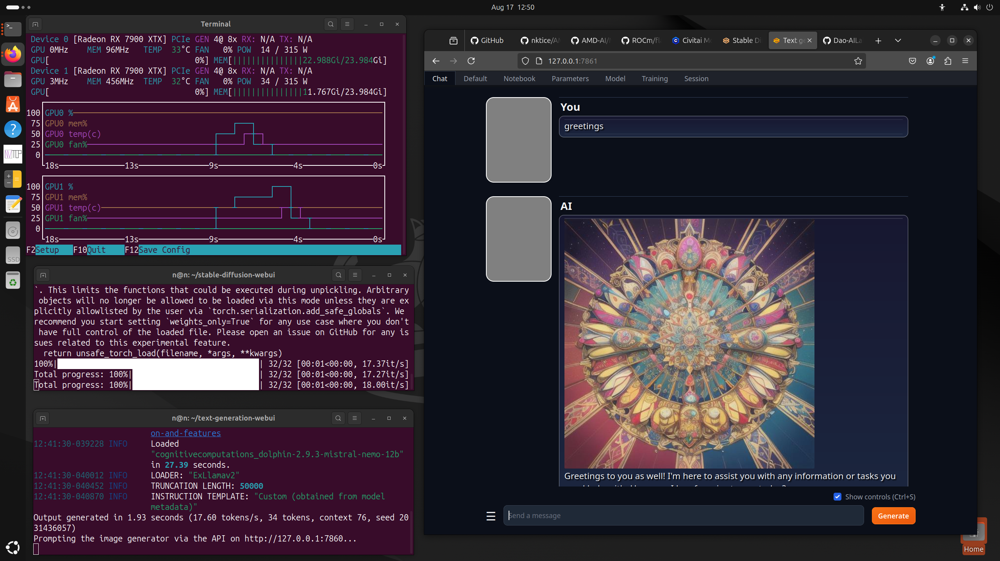

# AMD-AI - A choose your own adventure how-to user guide...
Tested on hardware : AMD Radeon 7900XTX and 6900XT GPUs ( including dual cards ), and the Ryzen AI Max 395+ ( Strix Halo ). 
# Ubuntu Linux 26.04 
# ROCm 10.0 ...
# Stable Diffusion (SDNext AMDGPUs ) + ComfyUI  ( venv ) 
# Oobabooga - TextGen 

## Introduction 
Introduction note : I started writing this guide 2023, because at the time I had a lot of trouble getting stuff running.  There was a range of partial or out of date guides that I came across...  So I set out to write a fairly complete guide to help fill the void.  Many things have changed, and there's lots of small details that have come and gone.  Generally things have improved over the months I've been doing this.  As much as I'd hoped all the issues would resolve, and it'd be easy to do everything making such guide redundant, that's yet to happen.  There appear to be a lot of fiddly bits that need attention, simple workarounds to make things work together that aren't well explained. 

Please note that there is another supplemental set of instructions to use Ollama, and related tools ( Cluade Code, LiteLLM, Aider ) kept in a separate page for simplicity - https://github.com/nktice/AMD-AI/blob/main/ollama-litellm-aider.md

## Install notes / instructions / changelog 
2026-09-03 - Update to ROCm 10.0 ... 

--------

# Ubuntu 26.04 - Base system install 
We are following the guide for ROCm install from AMD's website - https://rocm.docs.amd.com/en/docs-10.0.0/ 

At this point we assume you've done the system install
and you know what that is, have a user, root, etc. 

```bash
# update system packages 
sudo apt update -y && sudo apt upgrade -y 
```

## Add AMD GPU package sources 

Per their instructions install required systems...
```
sudo apt install libatomic1 libquadmath0
```

## Prep user
```
# Add the current user to the render and video groups
sudo usermod -a -G render,video $LOGNAME
```

Make the directory if it doesn't exist yet.
This location is recommended by the distribution maintainers.
https://rocm.docs.amd.com/projects/install-on-linux/en/latest/install/install-methods/package-manager/package-manager-ubuntu.html

```bash
# Download and install GPG key
sudo mkdir --parents --mode=0755 /etc/apt/keyrings
wget https://stable.repo.amd.com/rocm/gpg/packages.gpg -O - | \
    gpg --dearmor | sudo tee /etc/apt/keyrings/amdrocm.gpg > /dev/null

sudo tee /etc/apt/sources.list.d/amdrocm-stable.sources << EOF
X-Repo-Id: amdrocm-stable
Types: deb
URIs: https://stable.repo.amd.com/rocm/core/packages/ubuntu2604/
Suites: stable
Components: main
Architectures: amd64
Signed-By: /etc/apt/keyrings/amdrocm.gpg
Enabled: yes
EOF

sudo apt update
```

# More AMD ROCm related packages 
Here's a complete list of packages they offer and what they include...

```bash
# ROCm...
sudo apt install amdrocm10.0
# And if you're ever going to want to compile anything related... [ the dev file names / packages have all changed... ] 
# sudo apt install amdrocm-core-dev10.0
```

```bash
# update path
echo "PATH=/opt/rocm/bin:/opt/rocm/opencl/bin:$PATH" >> ~/.profile
```


## Find graphics device
```bash
sudo /opt/rocm/bin/rocminfo | grep gfx
```
Examples of things you'd see... 
Found : gfx1030 [ Radeon 6900 ]
Found : gfx1100 [ Radeon 7900 ] 
Found : gfx1151 [ Ryzen AI Max 395+ ( Strix Halo ) ] 


## Useful packages --
```bash
# git and git-lfs (large file support
sudo apt install -y git git-lfs
# development tool may be required later...
sudo apt install -y libstdc++-12-dev
# stable diffusion likes TCMalloc...
sudo apt install -y libtcmalloc-minimal4
```

## Performance Tuning
This section is optional, and as such has been moved to [performance-tuning](https://github.com/nktice/AMD-AI/blob/main/performance-tuning.md)

## Top for video memory and usage
nvtop 
Note : I have had issues with the distro version crashes with 2 GPUs, installing new version from sources works fine.  Instructions for that are included at the bottom, as they depend on things installed between here and there.   Project website : https://github.com/Syllo/nvtop 
```bash
sudo apt install -y nvtop 
```

An alternative that seems worth mentioning here is Mission Center : https://missioncenter.io/ 
It doesn't use apt, so we won't install it here, folks can look it up. 


## Radeon specific tools...
```bash
sudo apt install -y radeontop 
```

## and now we reboot...
```bash
reboot
```

## End of OS / base setup

--------

# Stable Diffusion 
Stable Diffusion is an amazing system to make AI art.  SDNext is a well maintained and excellent successor to the older A1111 and similar systems.


## SDNext
Here are instructions for for setting up SD Next a descendent of Stable Diffusion that looks like it is maintained at the present time.  Project page : https://github.com/vladmandic/sdnext 
2025-11-03 - Added these instructions...

2026-09-06 - Had to update to use deadsnakes to get a supported version of python...

```bash
sudo apt update
sudo apt install software-properties-common
sudo add-apt-repository ppa:deadsnakes/ppa -y
sudo apt update

sudo apt install python3.13 python3.13-venv -y
```

First we download the latest from GitHub...
```bash
cd
git clone https://github.com/vladmandic/sdnext.git
cd sdnext
```

Only if you need a newer version of torch than what it installs... 
SDNext is descended from Stable Diffusion such as seen above... so there is a lot of similar config, such as with venv... we'll want to pre-empt the default install methods and get torch installed...  
```bash
python3.13 -m venv venv
source venv/bin/activate
# upgrade pip
python3 -m pip install -U pip
# If you want to pre-install torch and torchvision from nightlies
python3 -m pip install --pre torch torchvision  --extra-index-url https://download.pytorch.org/whl/nightly/rocm10.0
## alternatively testing the newest versions of ROCm libraries / nightly compiles of 'theRock' - which may not work...
## see their page at : https://github.com/ROCm/TheRock/blob/main/RELEASES.md 
## Here are commands for strix-halo...
# pip install --index-url https://rocm.nightlies.amd.com/v2/gfx1151/ "rocm[libraries,devel]"
# pip install --index-url https://rocm.nightlies.amd.com/v2/gfx1151/ torch torchaudio torchvision
deactivate 
```


If you want to set configuration options it also can use the same file name as the older sd versions - alas they haven't offered examples, so I will offer one here for something I want.
This parameter allows JavaScript access to the API... I've remarked this out, as it may not be secure for other users.
```bash
tee --append webui-user.sh <<EOF
# export COMMANDLINE_ARGS="--cors-origins=*"
EOF
```


Now we run the script that goes and sets it all up as they would expect... 
Sometimes it has errored, and needed running again to get all it wants.  
Once it is setup then this command will run what is setup / installed. 
```bash
./webui.sh
```

## Note on memory use with SDNext ... 
2025-11-25 - 
A friend that I helped found that when generating lots of images system memory was a gradual slope up until program crash.  Turns out pymalloc is known to have some issues freeing memory.  SDNext's wiki has details for alternate memory systems - https://github.com/vladmandic/sdnext/wiki/Malloc - We switched over to the use of jemalloc and that resolved things. 

To make that easy, here's commands that users can copy for themselves...
```bash
sudo apt install libjemalloc2
sudo ldconfig
tee --append sdnext.sh <<EOF
#!/bin/sh
#script to call webui.sh with parameters... add others if you like below... 
export LD_PRELOAD=libjemalloc.so.2  
./webui.sh --debug
# if you have models you can specify them on the command line such as with the following :
#./webui.sh --debug --models-dir ~/models
EOF
chmod +x sdnext.sh
```
That creates a script called sdnext.sh for users to run. 


## End SDNext

# End of Stable Diffusion 

---


--- 

# ComfyUI 
- variation of https://raw.githubusercontent.com/ltdrdata/ComfyUI-Manager/main/scripts/install-comfyui-venv-linux.sh 
Includes ComfyUI-Manager
2025-10-22 - ComfyUI has been actively developed, and as such it can use modern python that comes in the packages ( old one also works... )   It's also quite fast ( compared to the old SD systems from above... ).  


```bash
cd 
git clone https://github.com/comfyanonymous/ComfyUI
cd ComfyUI/custom_nodes
git clone https://github.com/ltdrdata/ComfyUI-Manager
cd ..
python3 -m venv venv
source venv/bin/activate
python3 -m pip install -U pip 
## pre-install torch and torchvision from nightlies - note you may want to update versions... 
#python3 -m pip install --pre torch torchvision --extra-index-url https://download.pytorch.org/whl/nightly/rocm10.0
## Note the following manually includes the contents of requirements.txt - because otherwise attempting to install the requirements goes and reinstalls torch over again. 
python3 -m pip install -r requirements.txt  --extra-index-url https://download.pytorch.org/whl/nightly/rocm10.0

python3 -m pip install -r custom_nodes/ComfyUI-Manager/requirements.txt --extra-index-url https://download.pytorch.org/whl/nightly/rocm10.0

# end vend if needed...
deactivate
```

Scripts for running the program...
Note that " TORCH_BLAS_PREFER_HIPBLASLT=0 " was needed as explained here - https://github.com/comfyanonymous/ComfyUI/issues/3698

```bash
# run_gpu.sh
tee --append run_gpu.sh <<EOF
#!/bin/bash
source venv/bin/activate
TORCH_BLAS_PREFER_HIPBLASLT=0 python3 main.py --preview-method auto
EOF
chmod +x run_gpu.sh

#run_cpu.sh
tee --append run_cpu.sh <<EOF
#!/bin/bash
source venv/bin/activate
TORCH_BLAS_PREFER_HIPBLASLT=0 python3 main.py --preview-method auto --cpu
EOF
chmod +x run_cpu.sh
```

Update the config file to point to Stable Diffusion (presuming it's installed...)

2025-10-17 - The format of this file has been completely changed, so the following code that used to work doesn't anymore...  This does give a clue as to what the config file is named and what you might want to do with it. 

```bash
## config file - connecto stable-diffusion-webui 
#cp extra_model_paths.yaml.example extra_model_paths.yaml
#sed -i "s@path/to@`echo ~`@g" extra_model_paths.yaml
## edit config file to point to your checkpoints etc 
##vi extra_model_paths.yaml
```

Note with the models, it's looking for models in models/checkpoints - so you'll need to put models into that folder to get it to work, or configure things so that it can find the parts that you want to use. 

# End ComfyUI install


---

#  Oobabooga - TextGen - ROCm 
Project Website : https://github.com/oobabooga/textgen

## Conda
2025-10-23 - In working with Ubuntu 25.10 I found there's an issue with Conda in various forms.  Turns out Ubuntu is shipping with a version of md5sum that makes different results from standard version, thus causes messes... there's a work around, as I'll get to below... but in my review, I found that there is not need for a bunch of stuff that there used to be... Oobabooga now has a working installer that is usable.  [ It used to be that their installer didn't work, and so we needed to setup ourselves with the whole environment and dependencies... that appears over, so we can slim this all down to a few commands. ] 

Here are the details of the work-around to use for new Ubuntu ( 25.10 ) :
https://forum.anaconda.com/t/critical-installation-failure-persistent-internal-md5-mismatch-anaconda-miniconda-2025-06-on-ubuntu-25-10/107525

Here are the commands to switch to GNU version of md5sum :
```bash
sudo apt install curl coreutils-from-gnu coreutils-from-uutils- --allow-remove-essential
```

## Oobabooga / textgen - Install webui...

```bash
cd
git clone https://github.com/oobabooga/textgen
cd textgen
```

Models 
If you're new to this - new models can be downloaded from the shell via a python script, or from a form in the interface.
There are lots of them - http://huggingface.co 
Generally the GPTQ models by TheBloke are likely to load... https://huggingface.co/unsloth  The 30B/33B models will load on 24GB of VRAM, but may error, or run out of memory depending on usage and parameters.  

To get new models note the ~/textgen directory has a program " download-model.py " that is made for downloading models from HuggingFace's collection.  

If you have old models,  link pre-stored models into the models
```bash
# cd ~/textgen/user_data
# mv models models.1
# ln -s /path/to/models models
```

If you have your own user_data directory...
```
# mv ~/textgen/user_data user_data.1
# ln -s ~/user_data/ user_data
```


### Many things have changed so we're trying to use Oobabooga's installer 
2026-09-04 - There are some issues with running Textgen ( which does not appear to be in development at this point, the author having moved to Unsloth Studio ).  So the following is a list of what I did to get it working...  If you are wondering if it is worth the effort to do the upgrade, the claimed improvement is ROCm 10.0 is 3.3x faster at inference than ROCm 7x. 

This will only partially work, but it gets the conda environment how it wants it, so run this and it'll error but we'll go from there...
```bash
./start_linux.sh 
```

For me it barfs with errors that look like this 
```
  ERROR: HTTP error 404 while getting https://repo.radeon.com/rocm/manylinux/rocm-rel-7.2/torch-2.9.0%2Brocm7.2.0.lw.git7e1940d4-cp313-cp313-linux_x86_64.whl
ERROR: Could not install requirement torch==2.9.0+rocm7.2.0.lw.git7e1940d4 from https://repo.radeon.com/rocm/manylinux/rocm-rel-7.2/torch-2.9.0%2Brocm7.2.0.lw.git7e1940d4-cp313-cp313-linux_x86_64.whl because of HTTP error 404 Client Error: Not Found for url: https://repo.radeon.com/rocm/manylinux/rocm-rel-7.2/torch-2.9.0%2Brocm7.2.0.lw.git7e1940d4-cp313-cp313-linux_x86_64.whl for URL https://repo.radeon.com/rocm/manylinux/rocm-rel-7.2/torch-2.9.0%2Brocm7.2.0.lw.git7e1940d4-cp313-cp313-linux_x86_64.whl
```

To work around that... Next we will follow the local install of the latest llama.cpp - it's akin to the instructions I wrote here for the Strix-Halo  https://github.com/oobabooga/textgen/issues/7326#issuecomment-3587022402 

Initialize access to the Textgen's conda environment 
```bash
conda activate installer_files/env
```

Get llama.cpp the way textgen wants it...
```bash
git clone --recurse-submodules https://github.com/oobabooga/llama-cpp-binaries
# this breaks on the part where it includes the original llama.cpp code because it's addressed ssh not http...
cd llama-cpp-binaries/
## original 
git clone --recurse-submodules https://github.com/ggml-org/llama.cpp
```

Compile llama.cpp - notice the target - this needs to match the targets you want like gfx1151 for Strix Halo, or gfx1100 for Radeon 7900 XTX - `sudo rocminfo | grep -i gfx ` will show your yours. 
```bash
CMAKE_ARGS="-DLLAMA_HIPBLAS=ON -DGPU_TARGETS=gfx1151 -DGGML_HIP=ON  -DGGML_HIP_ROCWMMA_FATTN=ON" pip install -v . --force-reinstall --no-cache-dir   --extra-index-url https://download.pytorch.org/whl/nightly/rocm10.0
```

# Now back to textgen's requirements for AMD - 
```bash
cd ..
# manually install latest pytorch and torchvision 
python3 -m pip install --pre torch torchvision  --extra-index-url https://download.pytorch.org/whl/nightly/rocm10.0
# get the rest of the expected requirements 
python3 -m pip install -r ./requirements/full/requirements_amd.txt  --extra-index-url https://download.pytorch.org/whl/nightly/rocm10.0 
```

Leave conda env
```bash
conda deactivate
```

Now it should have all the stuff it needs to run
```bash
./start_linux.sh 
```

## End - Oobabooga - TextGen

2024-08-17 - 
Here's an example, nvtop, sd console, tgw console... 
this screencap taken using ROCm 6.1.3 - under this config : https://github.com/nktice/AMD-AI/blob/main/ROCm-6.1.3-Dev.md


-------

# nvtop from source
( As one from packages crashes on 2 GPUs, while this never version from sources works fine. ) 
project website : https://github.com/Syllo/nvtop
optional - tool for displaying gpu / memory usage info
The package for this crashes with 2 gpu's, here it is from source.
```bash
sudo apt install -y libdrm-dev libsystemd-dev libudev-dev cmake
cd 
git clone https://github.com/Syllo/nvtop.git
mkdir -p nvtop/build && cd nvtop/build
cmake .. -DNVIDIA_SUPPORT=OFF -DAMDGPU_SUPPORT=ON -DINTEL_SUPPORT=OFF
make
sudo make install
```
# end nvtop


