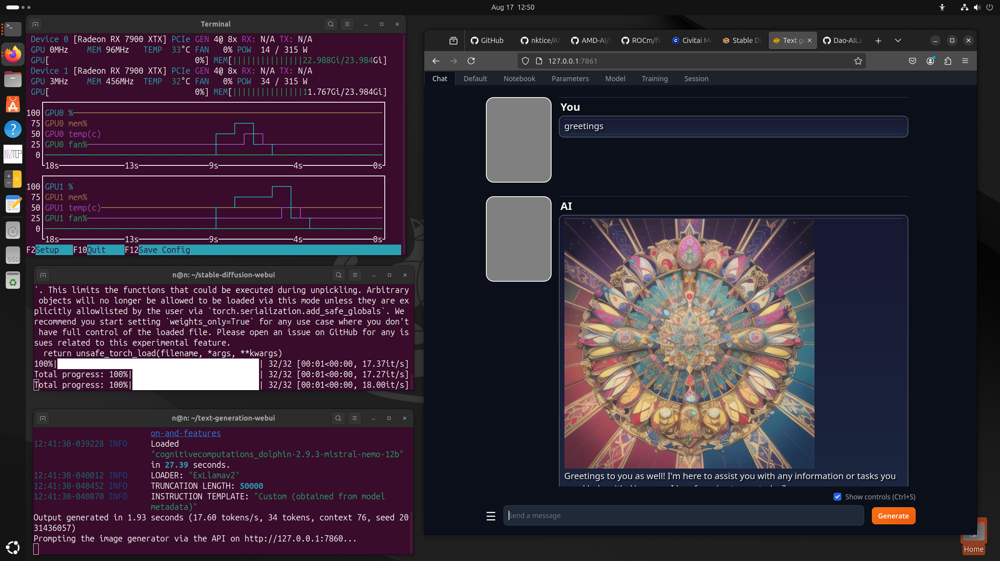

# AMD / Radeon 7900XTX 6900XT GPU ROCm install / setup / config 
# Ubuntu 22.04 / 23.04 / 23.10 / 24.04
# ROCm 6.1.3
# Automatic1111 Stable Diffusion + ComfyUI  ( venv ) 
# Oobabooga - Text Generation WebUI ( conda, Exllamav2, BitsAndBytes ) 

## Install notes / instructions / changelog ##

2023-07 - I have composed this collection of instructions as they are my notes, from varied efforts at a configuration that is consistent.  I've gone over these doing many re-installs to get them all right. This is what I had hoped to find when I had search for install instructions - so I'm sharing them in the hopes that they save time for other people. There may be in here extra parts that aren't needed but this works for me.  Originally text, with comments like a shell script that I cut and paste.

[ various updates abridged... ] 

2024-04-23 - 
- Updated for ROCm 6.1.  Apologies for not changing the file name / url - it appears not much as changed... so rather than a pile of new file names for every version, I'm going to continue the updates here until there's a reason not to.  https://rocm.docs.amd.com/en/latest/about/release-notes.html 
- Stable Diffusion section changed because Python3.12 is out, and Automatic1111 doesn't work with the new version of Python out of the box... but 3.11 seems to work fine, so we'll make it use that.

2024-05-12 - PyTorch stable now covers ROCm 6 series, and dev has moved on, new packages now point to ROCm 6.1 - so updates for that.  The new Ubuntu works with the newest drivers, so changes for that.  ROCm's new version 6.1.1 is out, so changes for that.  This guide is meant to refer to the dev versions ( rather than stable ).  Also includes notes for the newest Ubuntu LTS release ( 24.04 ) 

2024-06-04 - Updated to use ROCm 6.1.2

2024-06-18 - Updated to use ROCm 6.1.3... add Llama-cpp-python instructions.

2024-07-04 - Oobabooga TGW has updated to fix an issue with calling Stable Diffusion - https://github.com/oobabooga/text-generation-webui/issues/5993#event-13399938788 - with that there's updates to remove the workaround, and to add a new workaround because of a feature in newer Pytorch ( > 2.4.x ) documented here - https://github.com/comfyanonymous/ComfyUI/issues/3698 

2024-08-04 - ROCm 6.2 is out, and it includes official support for Ubuntu 24.04 - there is no longer need to refer to previous versions of Ubuntu, so before those revisions I'm setting aside this document for reference; It will no longer be maintained.  


--------


# Ubuntu 22.04 / 23.04 / 23.10 / 24.04 - Base system install 
Ubuntu 22.04 works great on Radeon 6900 XT video cards, 
but does not support 7900XTX cards as they came out later 
Ubuntu 23.04 is newer but has issues with some of the tools... 
note there's one command to include the old system that solves such issues. 
Ubuntu 23.10 - also generally working... 
Ubuntu 24.04 - now works too... note comments. 

At this point we assume you've done the system install
and you know what that is, have a user, root, etc. 

```bash
# update system packages 
sudo apt update -y && sudo apt upgrade -y 
```

```bash 
#turn on devel and sources.
sudo apt-add-repository -y -s -s
sudo apt install -y "linux-headers-$(uname -r)" \
	"linux-modules-extra-$(uname -r)"
```

#### [ for Ubuntu 23.04, 23.10, and 24.04 ... ]
Some things may require various old packages so we need to add
jammy packages, so that they can be installed, on lunar systems.
```bash
sudo add-apt-repository -y -s deb http://security.ubuntu.com/ubuntu jammy main universe
```

#### [ For Ubuntu 24.04 ... ] 
This allows calls to older versions of Python by using "deadsnakes" 
```bash
sudo add-apt-repository ppa:deadsnakes/ppa -y
sudo apt update -y 
```

## Add AMD GPU package sources 
Make the directory if it doesn't exist yet.
This location is recommended by the distribution maintainers.

```bash
sudo mkdir --parents --mode=0755 /etc/apt/keyrings
```

Download the key, convert the signing-key to a full
Keyring required by apt and store in the keyring directory
```bash
wget https://repo.radeon.com/rocm/rocm.gpg.key -O - | \
    gpg --dearmor | sudo tee /etc/apt/keyrings/rocm.gpg > /dev/null
```
amdgpu repository for jammy
```bash
echo 'deb [arch=amd64 signed-by=/etc/apt/keyrings/rocm.gpg] https://repo.radeon.com/amdgpu/6.1.3/ubuntu jammy main' \
    | sudo tee /etc/apt/sources.list.d/amdgpu.list
sudo apt update -y 
```

AMDGPU DKMS
```bash
sudo apt install -y amdgpu-dkms
```
Note : This commonly produces warning message about 'Possible missing firmware' these are just wanrings and things work anyway, they can be ignored. 

# ROCm repositories for jammy
https://rocmdocs.amd.com/en/latest/deploy/linux/os-native/install.html

```bash
echo "deb [arch=amd64 signed-by=/etc/apt/keyrings/rocm.gpg] https://repo.radeon.com/rocm/apt/6.1.3/ jammy main" \
    | sudo tee --append /etc/apt/sources.list.d/rocm.list
echo -e 'Package: *\nPin: release o=repo.radeon.com\nPin-Priority: 600' \
    | sudo tee /etc/apt/preferences.d/rocm-pin-600
sudo apt update -y
```

# More AMD ROCm related packages 
This is lots of stuff, but comparatively small so worth including,
as some stuff later may want as dependencies without much notice.
```bash
# ROCm...
sudo apt install -y rocm-dev rocm-libs rocm-hip-sdk rocm-dkms rocm-libs
```


```bash
# ld.so.conf update 
sudo tee --append /etc/ld.so.conf.d/rocm.conf <<EOF
/opt/rocm/lib
/opt/rocm/lib64
EOF
sudo ldconfig
```

```bash
# update path
echo "PATH=/opt/rocm/bin:/opt/rocm/opencl/bin:$PATH" >> ~/.profile
```

## Find graphics device
```bash
sudo /opt/rocm/bin/rocminfo | grep gfx
```
Found : gfx1030 [ Radeon 6900 ]
Found : gfx1100 [ Radeon 7900 ] 

## Add user to groups
Of course note to change the user name to match your user. 
```bash
sudo adduser `whoami` video
sudo adduser `whoami` render
```

```bash
# git and git-lfs (large file support
sudo apt install -y git git-lfs
# development tool may be required later...
sudo apt install -y libstdc++-12-dev
# stable diffusion likes TCMalloc...
sudo apt install -y libtcmalloc-minimal4
```

## Performance Tuning
This section is optional, and as such has been moved to [performance-tuning](https://github.com/nktice/AMD-AI/blob/main/performance-tuning.md)

## Top for video memory and usage
nvtop 
Note : I have had issues with the distro version crashes with 2 GPUs, installing new version from sources works fine.  Instructions for that are included at the bottom, as they depend on things installed between here and there.   Project website : https://github.com/Syllo/nvtop 
```bash
sudo apt install -y nvtop 
```

## Radeon specific tools...
```bash
sudo apt install -y radeontop rovclock
```

## and now we reboot...
```bash
sudo reboot
```

## End of OS / base setup

--------

# Stable Diffusion (Automatic1111) 
This system is built to use its own venv ( rather than Conda )...

## Download Stable Diffusion ( Automatic1111 webui ) 
https://github.com/AUTOMATIC1111/stable-diffusion-webui
Get the files...
```bash
cd
git clone https://github.com/AUTOMATIC1111/stable-diffusion-webui.git
cd stable-diffusion-webui
```

# Requisites : 
Automatic1111 / Stable Diffusion doesn't work with newer versions of python, so we specify one it works with. 
```bash
sudo apt install -y wget git python3.10 python3.10-venv libgl1
python3.10 -m venv venv
source venv/bin/activate
python3.10 -m pip install -U pip
deactivate
```

## Edit environment settings...
```bash
tee --append webui-user.sh <<EOF
# specify compatible python version
python_cmd="python3.10"
 ## Torch for ROCm
# generic import...
# export TORCH_COMMAND="pip install torch torchvision --index-url https://download.pytorch.org/whl/nightly"
# workaround for ROCm + Torch > 2.4.x - https://github.com/comfyanonymous/ComfyUI/issues/3698
 export TORCH_BLAS_PREFER_HIPBLASLT=0
# use specific versions to avoid downloading all the nightlies... ( update dates as needed )
 export TORCH_COMMAND="pip install --pre torch==2.5.0.dev20240724+rocm6.1 torchvision==0.20.0.dev20240725+rocm6.1 --extra-index-url https://download.pytorch.org/whl/nightly/rocm6.1"
 ## And if you want to call this from other programs...
 export COMMANDLINE_ARGS="--api"
 ## crashes with 2 cards, so to get it to run on the second card (only), unremark the following 
 # export CUDA_VISIBLE_DEVICES="1"
EOF
```


## If you keep models for SD somewhere, this is where you'd like them up...
If you don't do this, it will install a default to get you going. 
Note that these start files do include things that it needs you'll want to copy
into the folder where you have other models ( to avoid issues ) 
```bash
#mv models models.1
#ln -s /path/to/models models 
```

## Run SD...
 Note that the first time it starts it may take it a while to go and get things
 it's not always good about saying what it's up to. 
```bash
./webui.sh 
```

The first time this is run it will install the requirements. 


## end Stable Diffusion 

--- 

# ComfyUI install script 
- variation of https://raw.githubusercontent.com/ltdrdata/ComfyUI-Manager/main/scripts/install-comfyui-venv-linux.sh 
Includes ComfyUI-Manager

Install of packages like for Stable Diffusion ( included here in case you're not installed SD and just want ComfyUI... ) - but it's not bothered by Python 3.12... 
```bash
sudo apt install -y wget git python3.10 python3.10-venv libgl1 
```

```bash
cd 
git clone https://github.com/comfyanonymous/ComfyUI
cd ComfyUI/custom_nodes
git clone https://github.com/ltdrdata/ComfyUI-Manager
cd ..
python3.10 -m venv venv
source venv/bin/activate
python3.10 -m pip install -U pip 
## pre-install torch and torchvision from nightlies - note you may want to update versions... 
# python3.10 -m pip install --pre torch==2.5.0.dev20240704+rocm6.1 torchvision==0.20.0.dev20240704+rocm6.1 --extra-index-url https://download.pytorch.org/whl/nightly/rocm6.1
# python3.10 -m pip install -r requirements.txt  --extra-index-url https://download.pytorch.org/whl/nightly/rocm6.1
##
## Note the following manually includes the contents of requirements.txt - because otherwise attempting to install the requirements goes and reinstalls torch over again. 
python3.10 -m pip install --pre torch==2.5.0.dev20240724+rocm6.1 torchvision==0.20.0.dev20240725+rocm6.1  torchsde torchaudio einops transformers>=4.25.1 safetensors>=0.4.2 aiohttp pyyaml Pillow scipy tqdm psutil  --extra-index-url https://download.pytorch.org/whl/nightly/rocm6.1

python3.10 -m pip install -r custom_nodes/ComfyUI-Manager/requirements.txt --extra-index-url https://download.pytorch.org/whl/nightly/rocm6.1

# end vend if needed...
deactivate
```

Scripts for running the program...
Note that " TORCH_BLAS_PREFER_HIPBLASLT=0 " is needed as explained here - https://github.com/comfyanonymous/ComfyUI/issues/3698

```bash
# run_gpu.sh
tee --append run_gpu.sh <<EOF
#!/bin/bash
source venv/bin/activate
TORCH_BLAS_PREFER_HIPBLASLT=0 python3.10 main.py --preview-method auto
EOF
chmod +x run_gpu.sh

#run_cpu.sh
tee --append run_cpu.sh <<EOF
#!/bin/bash
source venv/bin/activate
TORCH_BLAS_PREFER_HIPBLASLT=0 python3.10 main.py --preview-method auto --cpu
EOF
chmod +x run_cpu.sh
```

Update the config file to point to Stable Diffusion (presuming it's installed...)
```bash
# config file - connecto stable-diffusion-webui 
cp extra_model_paths.yaml.example extra_model_paths.yaml
sed -i "s@path/to@`echo ~`@g" extra_model_paths.yaml
# edit config file to point to your checkpoints etc 
#vi extra_model_paths.yaml
```

## End ComfyUI install


---

#  Oobabooga - Text Generation WebUI - ROCm 
Project Website : https://github.com/oobabooga/text-generation-webui.git


## Conda
First we'll need Conda ... Required for pytorch... Conda provides virtual environments for python, so that programs with different dependencies can have different environments.
Here is more info on managing conda : https://docs.conda.io/projects/conda/en/latest/user-guide/getting-started.html#
Other notes : https://docs.conda.io/projects/conda/en/latest/user-guide/install/linux.html
Download info : https://www.anaconda.com/download/


Anaconda ( if you prefer this to miniconda below ) 
```bash
#cd ~/Downloads/
#wget https://repo.anaconda.com/archive/Anaconda3-2023.09-0-Linux-x86_64.sh
#bash Anaconda3-2023.09-0-Linux-x86_64.sh -b
#cd ~
#ln -s anaconda3 conda
```

Miniconda ( if you prefer this to Anaconda above... ) 
[ https://docs.conda.io/projects/miniconda/en/latest/ ] 
```bash
cd ~/Downloads/
wget https://repo.anaconda.com/miniconda/Miniconda3-latest-Linux-x86_64.sh
bash Miniconda3-latest-Linux-x86_64.sh -b
cd ~
ln -s miniconda3 conda
```

```bash
echo "PATH=~/conda/bin:$PATH" >> ~/.profile
source ~/.profile
conda update -y -n base -c defaults conda
```

```bash
conda install -y cmake ninja
```

```bash
conda init
source ~/.profile
```
### conda is now active...

### install pip
```bash
sudo apt install -y pip
pip3 install --upgrade pip
```

#### useful pip stuff to know ... 
```bash
## show outdated packages...
#pip list --outdated
## check dependencies 
#pip check
## install specified bersion 
#pip install <packagename>==<version>
```

### End conda and pip setup.

## Oobabooga / Textgen webui 
- https://github.com/oobabooga/text-generation-webui

```bash
conda create -n textgen python=3.11 -y
conda activate textgen
```

## PyTorch install...

```bash
# pre-install 
pip install --pre cmake colorama filelock lit numpy Pillow Jinja2 \
	mpmath fsspec MarkupSafe certifi filelock networkx \
	sympy packaging requests \
         --index-url https://download.pytorch.org/whl/nightly
```


Here is old method that works - but tries to download things back to the start of these releases which may take a while... so it is remarked... 
```bash
## install
#pip install torch torchvision torchtext torchaudio torchdata \
#	triton pytorch-triton pytorch-triton-rocm \
#         --index-url https://download.pytorch.org/whl/nightly/rocm5.7
```
Instead of that we go and look through the files at https://download.pytorch.org/whl/nightly/rocm6.1/ (note trailing slash) and in the program directories there, we can see the individual nightly build files.  One has been chosen at the time of writing this, if you want newer, that is where you can find those details to update the file names / versions.  

Here we refer to specific nightly versions to keep things simple. 
```bash
pip install --pre -U torch==2.5.0.dev20240722+rocm6.1 torchvision==0.20.0.dev20240723+rocm6.1  \
	torchaudio pytorch-triton pytorch-triton-rocm  \
	 --index-url https://download.pytorch.org/whl/nightly/rocm6.1
```

2024-05-12 For some odd reason, torchtext isn't recognized, even though it's there... so we specify it using it's URL to be explicit.
```bash
pip install https://download.pytorch.org/whl/cpu/torchtext-0.18.0%2Bcpu-cp311-cp311-linux_x86_64.whl#sha256=c760e672265cd6f3e4a7c8d4a78afe9e9617deacda926a743479ee0418d4207d
```

### Triton 
2023-09-11 : Usually we get Triton from the PyTorch nightly build files (included above)  but I had some errors [akin to these](https://github.com/openai/triton/issues/2002)  and found getting it fresh from the nightly build resovled them.
2023-12.17 : The issue appears to have been resolved, so I'm remarking this out, but leaving it here in case there are issues with Triton that may call for installing the nightly again.  
```bash
#pip install -U --index-url https://aiinfra.pkgs.visualstudio.com/PublicPackages/_packaging/Triton-Nightly/pypi/simple/ triton-nightly
```


### bitsandbytes rocm 
2024-04-24 - AMD's own ROCm version of bitsandbytes has been updated! - https://github.com/ROCm/bitsandbytes  ( ver 0.44.0.dev0 at time of writing ) 
```bash
# conda activate textgen
cd
git clone https://github.com/ROCm/bitsandbytes.git
cd bitsandbytes
pip install .
```


### Flash-Attention 2 :
Install may take a few mins ( takes author close to 5 minutes at time of writing )...
2024-01-18 - FA2 appears to be 'working' now... as in it compiles and installs normally. 
2024-04-03 - While this (2.0.4) version 'works' it isn't recent enough to be used by exllamav2 - Here is more info : https://github.com/turboderp/exllamav2/issues/397#issuecomment-2034652594 (2.2.1...) - it's a known issue and has had a support thread with the main authors - https://github.com/Dao-AILab/flash-attention/issues/707 
```bash
cd
git clone https://github.com/ROCmSoftwarePlatform/flash-attention.git
cd flash-attention
pip install . 
```


## Oobabooga / Text-generation-webui - Install webui...
```bash
cd
git clone https://github.com/oobabooga/text-generation-webui
cd text-generation-webui
```

### Oobabooga's 'requirements'
2024-07-26 Oobabooga release 1.12 changed how requirements are done, including calls that refer to old versions of PyTorch which didn't work for me... So the usual command here is remarked out, and I have instead offered a replacement requirements.txt with minimal includes, that combined with what else is here gets it up and running ( for me ), using more recent versions of packages. 

```bash
#sed -i "s@bitsandbytes==@bitsandbytes>=@g" requirements_amd.txt 
#pip install -r requirements_amd.txt 
```

```bash
tee --append requirements_amdai.txt <<EOF
# alternate simplified requirements from https://github.com/nktice/AMD-AI/edit/main/ROCm6.0.md 
accelerate>=0.32
colorama
datasets
einops
gradio>=4.26
hqq>=0.1.7.post3
jinja2>=3.1.4
lm_eval>=0.3.0
markdown
numba>=0.59
numpy>=1.26
optimum>=1.17
pandas
peft>=0.8
Pillow>=9.5.0
psutil
pyyaml
requests
rich
safetensors>=0.4
scipy
sentencepiece
tensorboard
transformers>=4.43
tqdm
wandb

# API
SpeechRecognition>=3.10.0
flask_cloudflared>=0.0.14
sse-starlette>=1.6.5
tiktoken

EOF
pip install -r requirements_amdai.txt  --extra-index-url https://download.pytorch.org/whl/nightly/rocm6.1
```


Exllamav2 loader 
```bash
git clone https://github.com/turboderp/exllamav2 repositories/exllamav2
cd repositories/exllamav2
pip install -r requirements.txt  --extra-index-url https://download.pytorch.org/whl/nightly/rocm6.1
pip install .   --extra-index-url https://download.pytorch.org/whl/nightly
cd ../..
```

Llama-cpp-python - 
- Another loader, that is highly efficient in resource use, but not very fast. https://github.com/abetlen/llama-cpp-python  It may need models in GGUF format ( and not other types ).
- Note compiling took 5:35 on my 5950x cpu... so be patient. 
```
## remove old versions
pip uninstall llama_cpp_python
pip uninstall llama_cpp_python_cuda
## install llama-cpp-python
git clone  --recurse-submodules  https://github.com/abetlen/llama-cpp-python.git repositories/llama-cpp-python 
cd repositories/llama-cpp-python
CC='/opt/rocm/llvm/bin/clang' CXX='/opt/rocm/llvm/bin/clang++' CFLAGS='-fPIC' CXXFLAGS='-fPIC' CMAKE_PREFIX_PATH='/opt/rocm' ROCM_PATH="/opt/rocm" HIP_PATH="/opt/rocm" CMAKE_ARGS="-GNinja -DLLAMA_HIPBLAS=ON -DLLAMA_AVX2=on " pip install --no-cache-dir .
cd ../.. 
```

Here's a supplement written when Mixtral was new and not supported for how to install Auto-GPTQ, and Llama.cpp at that time - deprecated now, but may be of interest for some explorers. 
https://github.com/nktice/AMD-AI/blob/main/Mixtral.md


Let's create a script (run.sh) to run the program... 
note "TORCH_BLAS_PREFER_HIPBLASLT=0" is to deal with the issue described here - https://github.com/comfyanonymous/ComfyUI/issues/3698
```bash
tee --append run.sh <<EOF
#!/bin/bash
## activate conda
conda activate textgen
## command to run server... 
TORCH_BLAS_PREFER_HIPBLASLT=0 python server.py --extensions sd_api_pictures send_pictures gallery
# if you want it to show up on your own network, add --listen 
#python server.py --listen --extensions sd_api_pictures send_pictures gallery 
conda deactivate
EOF
chmod u+x run.sh
```


Models 
If you're new to this - new models can be downloaded from the shell via a python script, or from a form in the interface.
There are lots of them - http://huggingface.co 
Generally the GPTQ models by TheBloke are likely to load... https://huggingface.co/TheBloke  The 30B/33B models will load on 24GB of VRAM, but may error, or run out of memory depending on usage and parameters.  
Worthy of mention, TurboDerp ( author of the exllama loaders ) has been posting exllamav2 ( exl2 ) processed versions of models - https://huggingface.co/turboderp ( for use with exllamav2 loader ) - when downloading, note the --branch option.  

To get new models note the ~/text-generation-webui directory has a program " download-model.py " that is made for downloading models from HuggingFace's collection.  

If you have old models,  link pre-stored models into the models
```bash
# cd ~/text-generation-webui
# mv models models.1
# ln -s /path/to/models models
```

Note that to run the script : 
```bash
# conda activate textgen
source run.sh
```

## End - Oobabooga - Text-Generation-WebUI


Here's an example, nvtop, sd console, tgw console... 
this screencap taken using ROCm 6.1.3 - under this config : https://github.com/nktice/AMD-AI/blob/main/ROCm-6.1.3-Dev.md


-------

# nvtop from source
( As one from packages crashes on 2 GPUs, while this never version from sources works fine. ) 
project website : https://github.com/Syllo/nvtop
optional - tool for displaying gpu / memory usage info
The package for this crashes with 2 gpu's, here it is from source.
```bash
sudo apt install -y libdrm-dev libsystemd-dev libudev-dev cmake
cd 
git clone https://github.com/Syllo/nvtop.git
mkdir -p nvtop/build && cd nvtop/build
cmake .. -DNVIDIA_SUPPORT=OFF -DAMDGPU_SUPPORT=ON -DINTEL_SUPPORT=OFF
make
sudo make install
```
# end nvtop


